<h1 align="center">
<br>
  
<br>
Test
</h1>

## Tools

This application features tools backend development!

- 💹 **NodeJs** — A web framework for Node Js
- ♻️ **Express** — Framework web application Node.js
- 📄 **Prisma.io** — ORM that helps app developers build faster and make fewer errors
- 💾 **Sqlite** — Automate Your Development Process Quickly Database
- 🗄 **Multer** — Middleware for handling uploads
- 📤 **Nodemailer** — Nodemailer is a module for Node.js applications to allow easy as cake email sending
- 📝 **Ethereal Email (Local)** — is a Fake SMTP service
- 📝 **Jest** — Framework test

## Getting started

1. Clone this repo using `git clone git@github.com:alanhrc/DEV-QuickDev-Test-Backend.git`
2. Move yourself to the appropriate directory: `cd DEV-QuickDev-Test-Backend`<br />
3. Run `npm install` to install dependencies<br />
4. Configure variables PROVIDER and URL in `prisma/schema.prisma` for access database<br />
5. Run `npx prisma migrate dev` to create columns database

### Getting started with the backend server

1. Run `npm run dev` to start the server

## Require Features

1. (): Elabore um documento Readme.md no projeto que tenha os seguintes detalhes:<br />
a. Descreva a stack utilizada, como versão da linguagem utilizada, framework e o
porquê de ter escolhido, pacotes adicionados, banco de dados, etc....<br />
b. Descreva como subir o sistema para executar os testes.<br />

2. (): A estrutura base do sistema vai contar com 3 entidades:

```json
User:
id: id primary_key
name: string:100
email: string:191
```

<br />

```json
Post:
id: id primary_key
user_id: id foreign:users
title: string:100
description: text
```

<br />

```json
Comment:
id: id primary_key
user_id: id foreign:users
post_id: id foreign:posts
description: text
```

<br />
essas são as exigências mínimas para essa atividade.<br />

3. (): Crie um sistema de autenticação por token para chamas de REST API.<br />

4. (): Com o usuário você pode fazer dois processos de CRUD:
a. CRUD simples;<br />
i. Colocar checagem de permissão se possuir autenticação;<br />
b. Ou se possuir autenticação;<br />
i. Registro na fase de autenticação com edição de perfil do usuário logado.<br />

5. (): Com as postagens é preciso fazer um CRUD simples com algumas exigências:<br />
a. Apenas o próprio usuário pode editar ou excluir as postagens;<br />
b. (): a postagem tenha a possibilidade de adicionar uma imagem em uma api
dedicada a isso;<br />
c. (): as edições sejam salvas como um histórico;<br />
d. (): a postagem tenha um contador de visualizações;<br />
e. (): a postagem tenha um contador de curtidas e não curtidas;<br />

6. (): Com os comentários é preciso fazer um CRUD simples com algumas exigências:<br />
a. Apenas o próprio usuário pode editar os comentários;<br />
b. Usuário do comentário pode remover o comentário;<br />
c. (): Usuário da postagem também pode remover o comentário;<br />
d. (): adicionar marcador que foi removida pelo usuário ou dono da postagem;<br />
e. (): Mandar um e-mail para o usuário da postagem que ele possui um novo
comentário em seu post;<br />

7. (): Crie uma rota que gere um relatório que traga os posts com os seguintes campos:
a. Título;
b. Quantos comentários eles possuem;
c. (): Quantas visualizações;
d. (): Quantas curtidas;
e. (): Quantas não curtidas;

8. (): Documentar as chamadas da API com uma ferramenta de requisição, exemplo: Postman
e enviar o arquivo de configuração;

## Tests Application

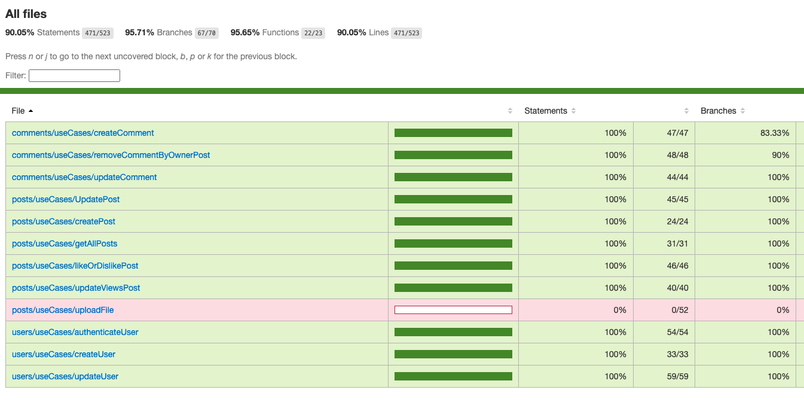

<br />

## License

### Users
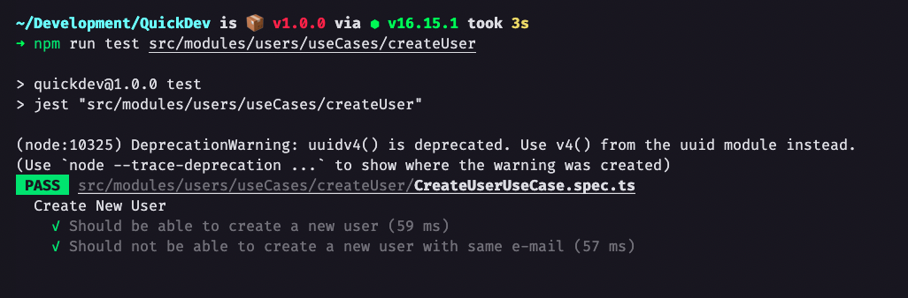
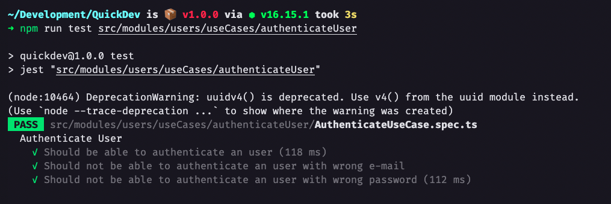


<br />

### Posts
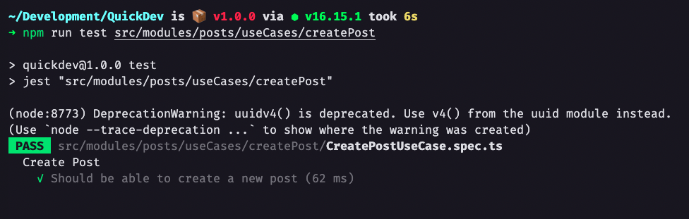
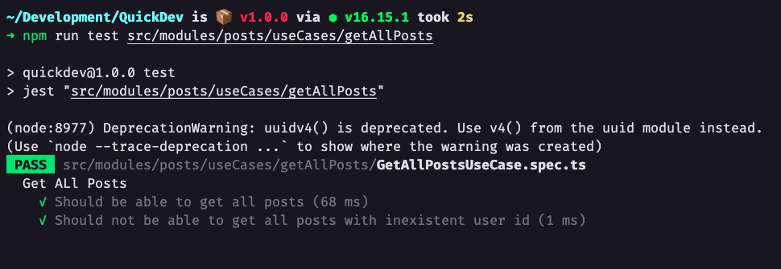
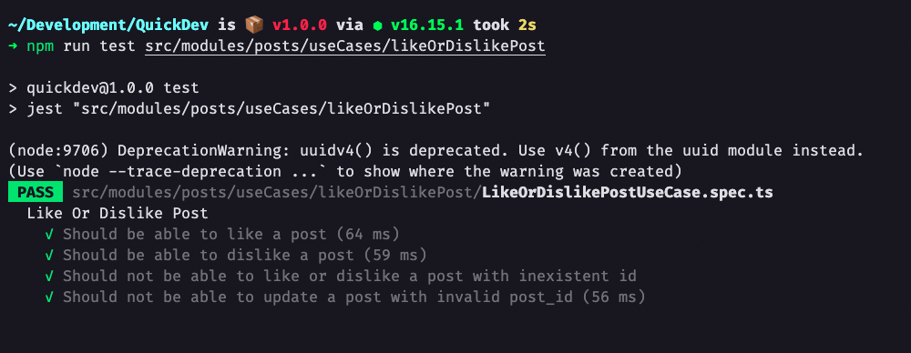
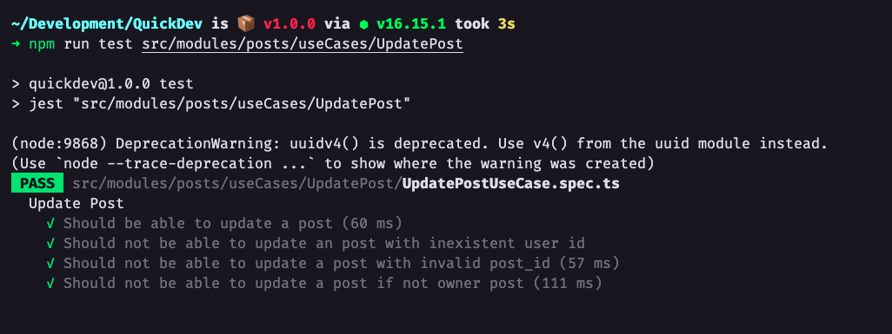
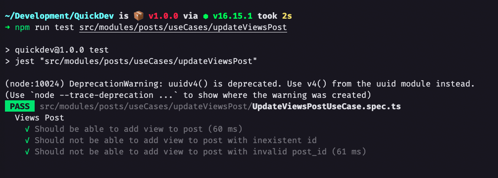
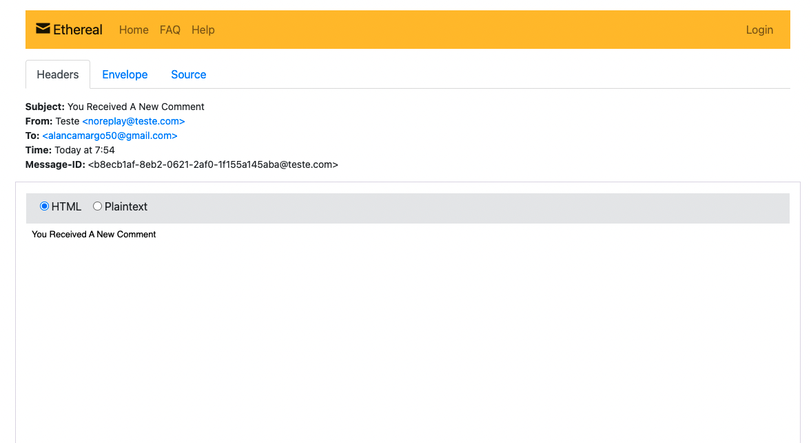

<br />

### Comments
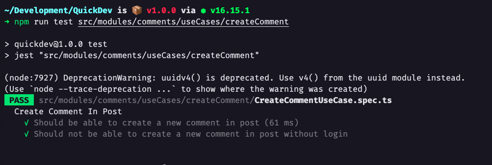
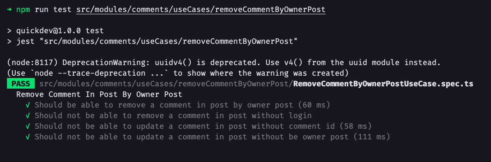
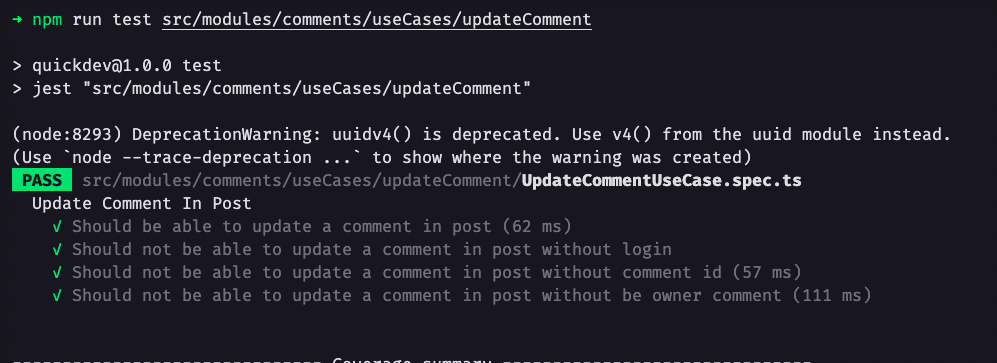

<br />

This project is licensed under the MIT License - see the [LICENSE](https://opensource.org/licenses/MIT) page for details.
